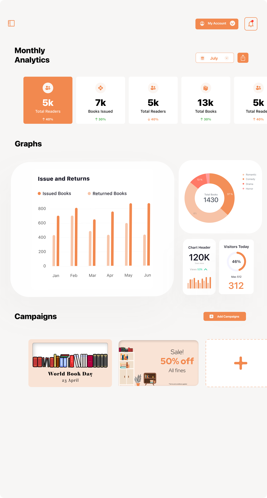
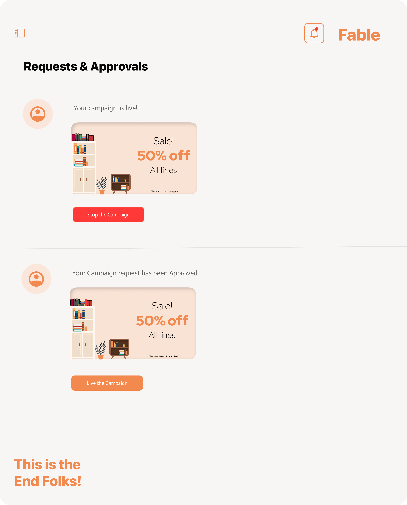
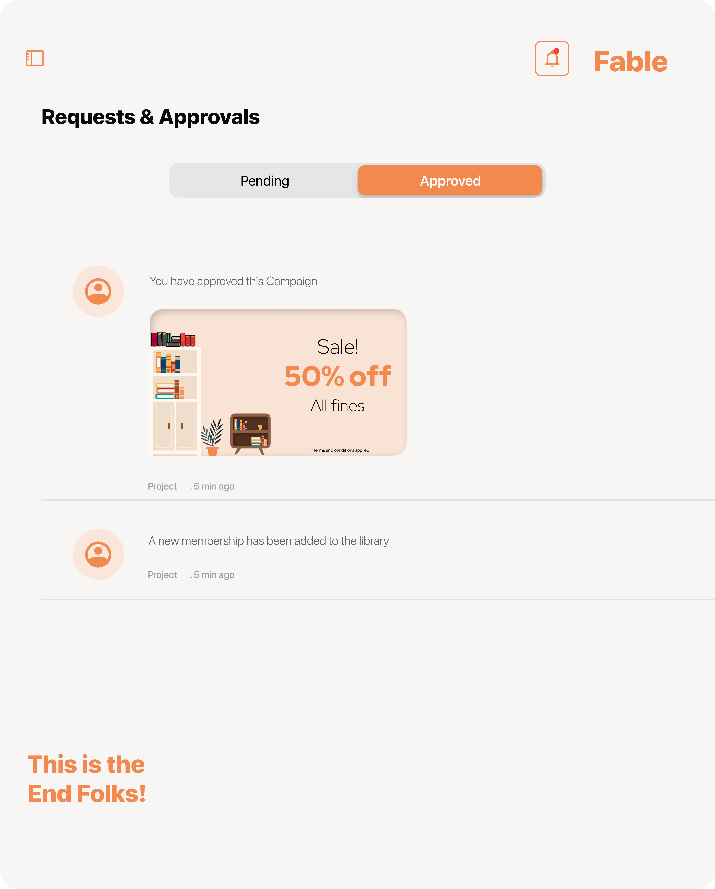
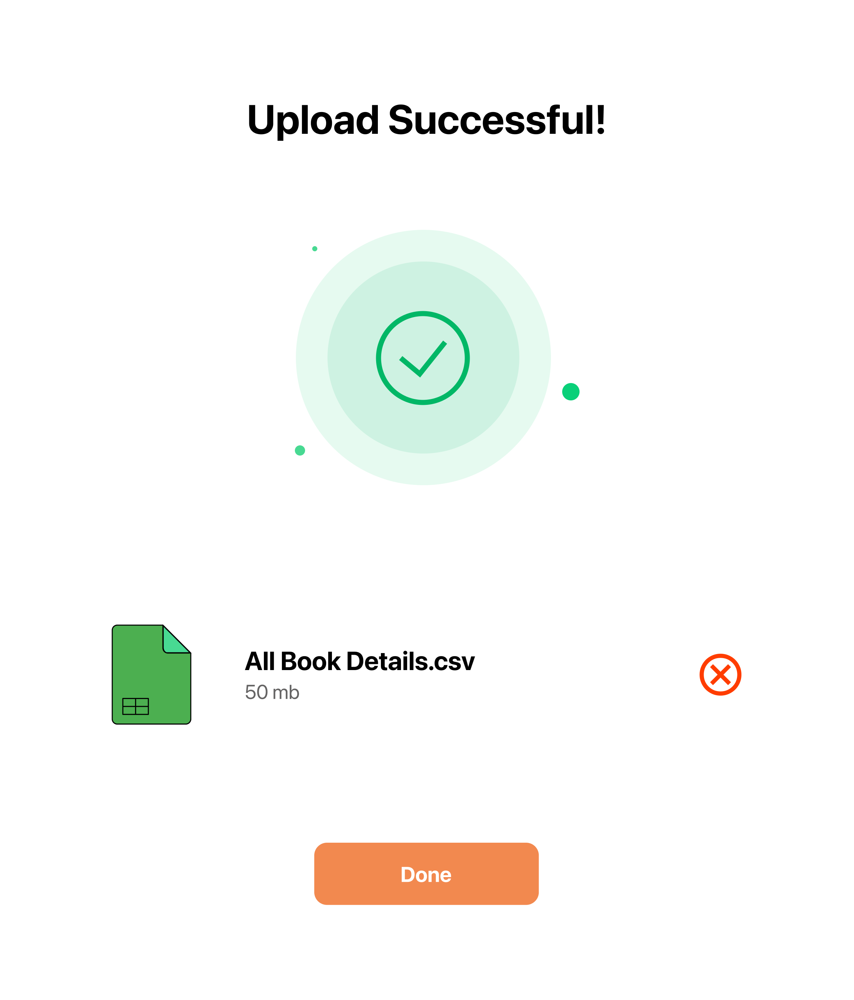
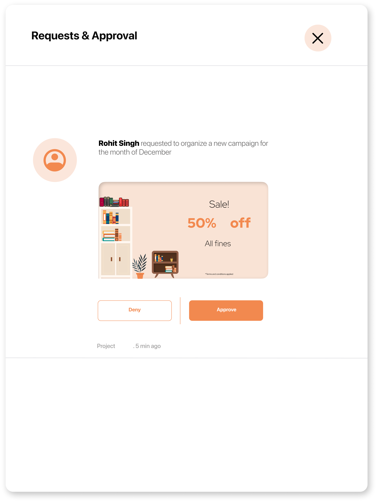

# 📚 Fable — Library Management System (iOS)

> **⚠️ Note:** This is a case study repository. Source code is confidential and proprietary to Infosys. This repo documents my work, role, and technical contributions during the internship.

[](https://developer.apple.com/swiftui/)
[](https://firebase.google.com)
[](https://www.atlassian.com/software/jira)
[](https://apple.com/ios)
[](https://www.infosys.com)
[]()

[📸 Screenshots](#screenshots) • [👤 My Role](#my-role) • [🏗 Architecture](#architecture) • [🛠 Tech Stack](#tech-stack) • [📋 Agile Process](#agile-process)

---

## 🧠 The Problem

Managing a library at scale — books, users, librarians, admins — involves complex workflows that don't work well on paper or in disconnected spreadsheets. Infosys needed a functional LMS prototype to demonstrate a clean, role-based mobile system for a mock SaaS client engagement.

The challenge: build **two separate iOS apps** (one for end users, one for librarians and admins) that share a live backend — with distinct permissions, real-time data sync, and an intuitive UI across all user roles.

---

## ✨ What We Built

A two-app iOS ecosystem for library management:
> The system was branded as **Fable** — a SaaS library platform built for a mock Infosys client engagement.

| App | Users | Purpose |
|-----|-------|---------|
| **LMS User App** | Students / Members | Browse catalog, issue books, track borrowing history, view progress |
| **LMS Admin & Librarian App** | Librarians / Admins | Manage books, approve requests, view analytics, handle complaints |

Both apps share a single **Firebase Firestore backend** with role-based access control and live data sync across all devices.

---

## 🔑 Key Features

### 📱 User App
| Feature | Description |
|---------|-------------|
| 🔐 **Authentication** | Firebase Auth — secure email/password login and session management |
| 📖 **Course / Book Catalog** | Browse available titles with search and filter |
| 📊 **Progress Tracking** | Real-time dashboard showing borrowing history and active issues |
| ☁️ **Live Sync** | Firestore-backed data updates instantly across all iOS devices |

### 🛠 Admin & Librarian App
| Feature | Description |
|---------|-------------|
| 📈 **Daily Analytics Dashboard** | Visual stats — weekly trends, key metrics, graphs |
| ✅ **Requests & Approvals** | Approve or reject user book requests in real time |
| 📤 **Upload & Catalog Management** | Add, update, and manage the book catalog |
| 🗂 **Complaints Management** | View and resolve user-submitted complaints |
| 🔐 **Role-Based Access** | Separate permission layers for Admin vs Librarian roles |

---

## 📸 Screenshots

> Screenshots from the Admin & Librarian app (Figma design exports)

### Analytics Dashboard
| Daily Analytics | Weekly Trends & Graphs |
|---|---|
|  |  |

### Requests & Approvals
| Requests List | Approval Detail |
|---|---|
|  |  |

### Upload & Complaints
| Upload Success | Complaints View |
|---|---|
|  |  |

> 📂 Full screenshots in [`/docs/screenshots`](docs/screenshots)

---

## 👤 My Role

I wore two hats on this project: **Scrum Master** and **iOS Frontend Developer** — responsible for both the team's sprint execution and the entire SwiftUI UI layer across both apps.

### 🎯 iOS Frontend Development *(primary technical ownership)*

I built the complete SwiftUI frontend for **both apps** — every screen, every flow, from scratch:

**LMS User App — screens I built:**
- Login & authentication flow (Firebase Auth integration)
- Home screen and book catalog browser
- Book detail and issue request flow
- Progress tracking dashboard with live Firestore reads
- User profile and borrowing history

**LMS Admin & Librarian App — screens I built:**
- Role-based login with admin/librarian routing
- Daily analytics dashboard — stats cards, weekly graphs, key metrics
- Requests & approvals flow — list view, detail view, approve/reject actions
- Book upload and catalog management screens
- Complaints management view

**Accessibility contribution:**
Proposed and implemented adaptive color scheme behaviour — UI colors adjust intelligently in system invert mode to improve readability for color-blind users. This was raised as an improvement suggestion during a sprint review and adopted into the final build.

### 📋 Scrum Master

- Facilitated daily standups and sprint planning sessions for a team of 10
- Maintained the Jira board — created, assigned, and tracked 10+ sprint issues through to resolution
- Acted as the bridge between the UI/UX designer, backend developers, and the team lead
- Ensured features were scoped, prioritised, and shipped on schedule within the 2-month internship window

---

## 🏗 Architecture

```
LMS iOS Ecosystem
├── LMS User App (SwiftUI)
│   ├── Auth/
│   │   ├── LoginView.swift
│   │   └── SignUpView.swift
│   ├── Home/
│   │   ├── HomeView.swift
│   │   └── CatalogView.swift
│   ├── Progress/
│   │   └── ProgressDashboardView.swift
│   ├── Profile/
│   │   └── ProfileView.swift
│   └── Services/
│       ├── FirebaseAuthService.swift
│       └── FirestoreService.swift
│
└── LMS Admin & Librarian App (SwiftUI)
    ├── Auth/
    │   └── RoleBasedLoginView.swift
    ├── Analytics/
    │   ├── DailyAnalyticsView.swift
    │   └── WeeklyGraphView.swift
    ├── Requests/
    │   ├── RequestsListView.swift
    │   └── ApprovalDetailView.swift
    ├── Catalog/
    │   └── BookUploadView.swift
    ├── Complaints/
    │   └── ComplaintsView.swift
    └── Services/
        ├── FirebaseAuthService.swift
        └── FirestoreService.swift

Shared Backend
└── Firebase
    ├── Firestore (NoSQL — books, users, requests, complaints)
    └── Authentication (role-based: user / librarian / admin)
```

---

## 🛠 Tech Stack

| Layer | Technology |
|-------|-----------|
| **Language** | Swift |
| **UI Framework** | SwiftUI |
| **Backend / Auth** | Firebase Authentication |
| **Database** | Firebase Firestore (NoSQL, real-time) |
| **IDE** | Xcode |
| **Project Management** | Jira |
| **Methodology** | Agile / Scrum |
| **Version Control** | Git + GitHub |
| **Design** | Figma |

---

## 📋 Agile Process

This project ran on a structured Agile/Scrum workflow over the 2-month internship:

- **Sprint length:** 1 week
- **Ceremonies:** Daily standups, weekly sprint planning, sprint reviews
- **Tooling:** Jira for issue tracking and sprint board management
- **My Scrum Master responsibilities:**
  - Ran all sprint ceremonies
  - Maintained and groomed the Jira backlog
  - Resolved blockers for frontend and backend team members
  - Tracked and closed 10+ sprint issues on schedule

---

## 👥 Team

| Role | Responsibility |
|------|---------------|
| **Nishant Sinha** *(me)* | Scrum Master · iOS Frontend Developer (both apps) |
| Team Lead | Overall project direction and architecture decisions |
| UI/UX Designer | Figma wireframes and visual design system |
| Backend Developers (×5) | Firebase integration, data models, auth logic |
| Presentation / QA | Documentation, testing, and demo preparation |

**Organisation:** Infosys, India
**Duration:** June – July 2024
**Context:** iOS App Developer Internship

---

## 📄 Confidentiality Note

This project was built during an internship at Infosys for a mock SaaS client engagement. The source code is confidential and proprietary. This repository exists solely to document my technical contributions, role, and learnings from the project.

---

Made with 💙 by [Nishant Sinha](https://github.com/NishantSinha7) · [LinkedIn](https://www.linkedin.com/in/nishant-sinha-0a1130319) · [Email](mailto:nishantsinha7122002@gmail.com)

*iOS App Developer Intern — Infosys, India, 2024*
